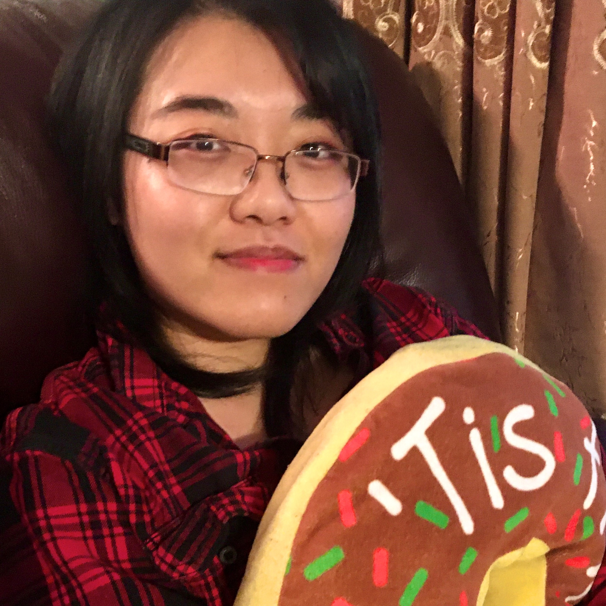
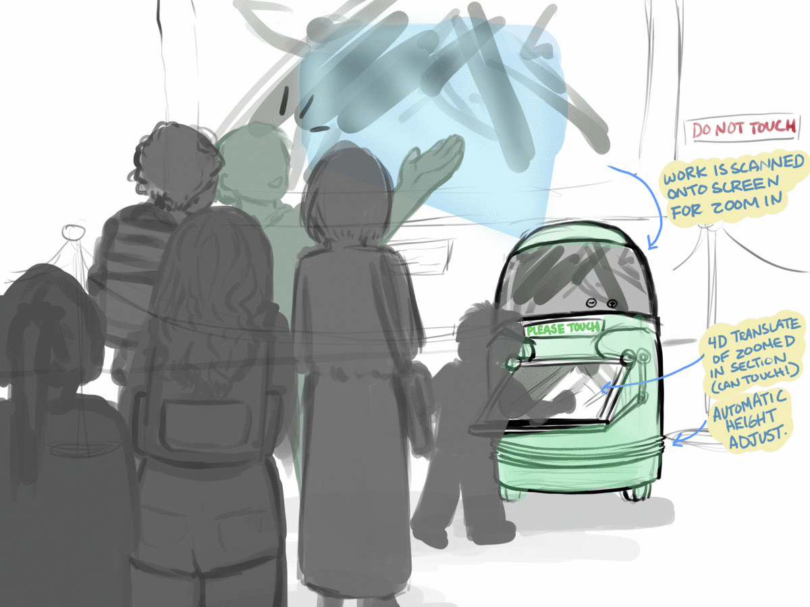
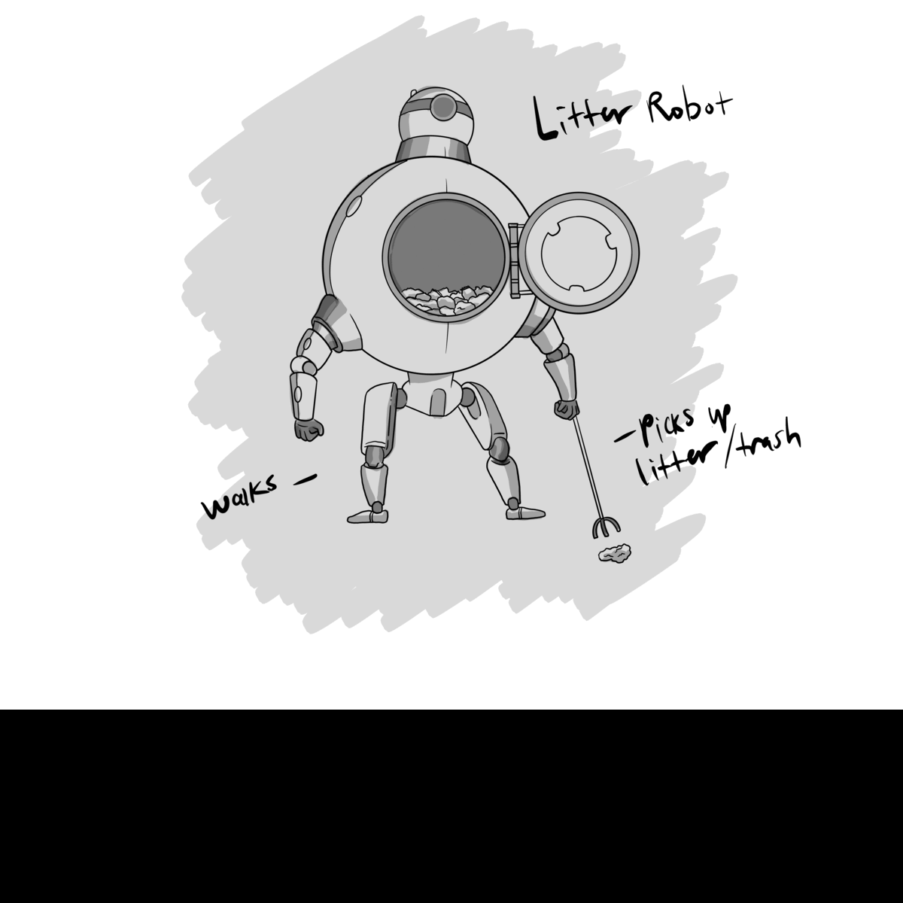

# Robotics+UMMA Student Art Exhibition

## Our Project
Robotics institute and the University of Michigan Museum of Art (UMMA) have been collaborating to imagine how a robot could encourage visitors’ curiosity and transform their art museum experience through interactive conversations. This partnership exemplifies the values of the U-M Arts Initiative, an organization that supports intentional cross-disciplinary projects that advance science, culture, and equity. 

## Our Goals 
- Encourage collaborative research between humanities and engineering disciplines
- Activate museum galleries as laboratories for learning
- Expand visitors’ understanding of what a museum can offer
- Create an inclusive museum environment by offering choice: recognize that some visitors prefer to interact with a machine than a human
- Invoke new and subtle understanding of art for our visitors
- Promote visitor curiosity about art
- Spark conversation and deepen human relationships 
- Explore how robots can adapt to dynamic and evolving cultural spaces

## Our Student Artists

Dilan Huang: Dilan Huang is an undergraduate student at the University of Michigan - Penny W. Stamps School of Art and Design. She has worked in both digital and traditional media illustrating children's books featuring people of color and indie games produced by Wolverine Soft at the University of Michigan. 
 
 

Mellisa Lee: Mellisa Lee is an undergraduate student pursuing a Bachelor of Fine Arts (BFA) at the University of Michigan-Penny W. Stamps School of Art & Design. She has an academic focus in Anthropology and works currently as an illustrator for The Michigan Daily. Aside from digital illustration, Mellisa is also a painter. 
 

Our Student Artists Inspire us to envision what a robot in a museum might look like 

Michigan Robotics and UMMA staff have some ideas, but artists often can envision a future that others haven’t yet imagined. We wondered what possibilities two students from Penny W. Stamps School of Art and Design might come up with. We hoped they would lead the Robotics-UMMA team to new directions or undiscovered paths. 

## Our Storyboards
### Dilan's Storyboard

 
### Mellisa's Storyboard

 

## Collaborative Process
First, our Robotics and Museum team described the partnership and project goals. Then we asked Dilan Huang and Mellisa Lee to dream, sketch, and plot out their version of Human-Robot interaction. They brought their own experiences and needs to the conversation and presented preliminary sketches of what students may appreciate in a visitor-robot museum experience. Touch, imagination, floating images, co-navigators, dance parties! We discussed and refined, and they finalized five illustrations that may provide a road map for the future of the project. 

## Robotics Team 
We as Roboticist tend to stay within the lines of what technology can offer presently or in the near future. Opening up the floor of discussion to artists and designer is one way we can step out of box to define what Robots of the future should like and try to take small steps into making these ideas come true! 
If you have more questions about the project, please reach out to Tribhi Kathuria (tribhi@umich.edu), PhD Candidate in Robotics. 

## Support 
Dilan and Mellisa’s time, prints, and exhibition were supported by [U-M’s Diversity, Equity, and Innovation Grant](https://diversity.umich.edu/). Our team wanted to promote the emerging careers of visual artists, allow them to do what they do well--make art, and encourage students to lead us forward in our project design. 

